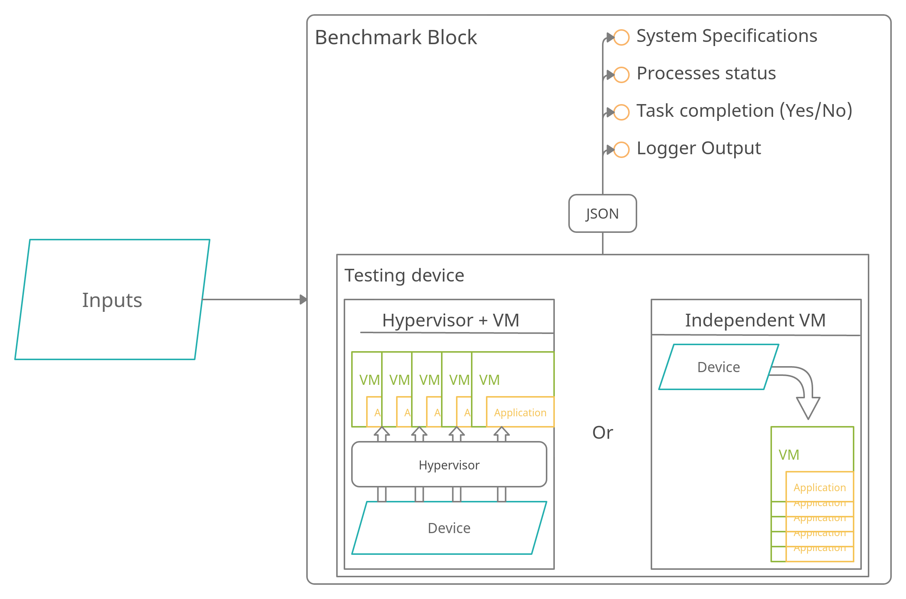

# OpenForBC-Benchmark

A full-fledged suite of ready-to-run benchmarks to measure the performances of various partitioning options on GPUs.

<!-- ## Features  -->

## Installation

Run the `requirements.txt` file to download the required packages.


## Usage
1.
````
uvicorn main:app 
````

