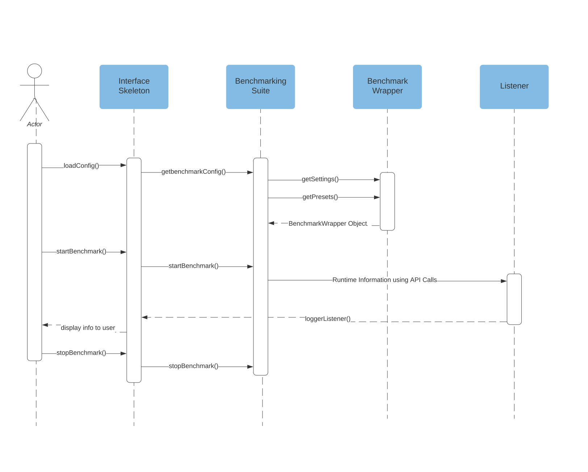

# OpenForBC-Benchmark

OpenForBC-Benchmark is a full-fledged suite of ready-to-run benchmarks in order to measure the performances of various partitioning options on GPUs. 


## Installation

- Clone the repository

```bash
git clone https://github.com/Open-ForBC/OpenForBC-Benchmark.git
```

- Install the required python libraries by running 

```bash
pip install -r requirements.txt
```


## Usage

Benchmarks can be run interactively using the following command.

```python
 python3 user_interfaces/cli.py interactive
```

Interactive interface is quite intuitive to navigate around, with informative prompts to guide you. 


For a textual CLI interface, you can use the following commands

1. List Benchmarks/Suites:  

```
python3 user_interfaces/cli.py list-benchmarks -v <int>
python3 user_interfaces/cli.py list-suites
```

2. Get settings from a particular benchmark:


```python
python3 user_interfaces/cli.py get-settings <benchmark> <benchmark-settings>
```
for example

```
python3 user_interfaces/cli.py get-settings blender_benchmark scenes list
```

3. Run a benchmark/Suite:


```python 
python3 user_interfaces/cli.py run-benchmark <name of benchmark> 
python3 user_interfaces/cli.py run-suite <name of suite> 
```
for example

```python
python3 user_interfaces/cli.py run-benchmark dummy_benchmark
```


All the above commands can be referred by using the following command 
```python
python3 user_interfaces/cli.py --help
```

## Adding a benchmark 

Following is the file hierarchy for the benchmarks folder.
```
.
├── benchmarks
│   ├── Sample Benchmark A
│   │   ├── benchmark_info.json                     *
│   │   ├── bin <contains executables/docs etc>
│   │   ├── implementation.py                       *
│   │   ├── settings                                *
│   │   │   ├── settings1.json
│   │   └── setup.py
│   └── Sample Benchmark B
│       ├── benchmark_info.json                     *
│       ├── implementation.py                       *
│       └── settings                                *
│       |   ├── settings1.json
│       |   └── settings2.json
        └── setup.sh

* Essential for executing benchmark
```
To add a benchmark, create a directory in the benchmarks folder similar to the Sample Benchmark directory as shown above.

-  The Benchmark implementation goes into the ```implementation.py``` folder. 

- Information about the benchmark is stored in ```benchmark_info.json``` with keys labelled as ```name```, ```description```,```implementation file``` and ```class name``` next to their corresponding values.

- Settings associated to the benchmark are placed in settings folder, to be saved as a json file. You can save more than one settings and select the one you want to run the benchmark with later when running the benchmark. 

<!-- [TODO: Add content to build onto the readme.] -->
<!-- 
 -->

